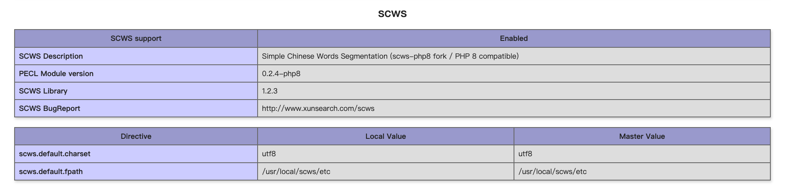
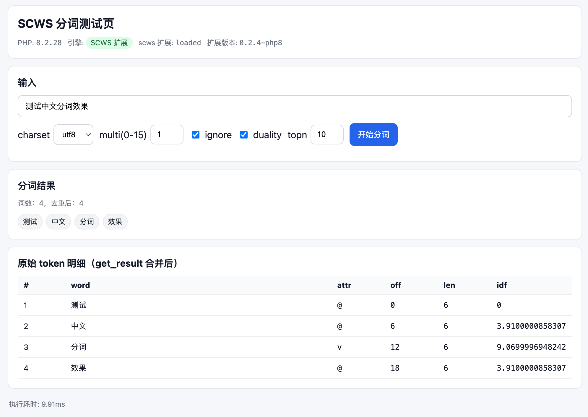

# scws-php8





基于 [`hightman/scws`](https://github.com/hightman/scws) 的 **PHP 扩展兼容分支**，目标是让 `scws` 能在 **PHP 8.0/8.1/8.2（及更高版本）** 上正常编译、加载和运行。

```借助AI工具，调整修改并测试运行```

## 改动总结（相对 [hightman/scws](https://github.com/hightman/scws)）

本分支（scws-php8）由 **jShi-git** 维护，在保留原作者 hightman 编程规范与注释风格（如 `/// hightman.YYMMDD: 说明`）的前提下，做如下核心改动，以便在 PHP 8.0/8.1/8.2 及更高版本上编译、加载并正常运行。

| 类别 | 说明 |
|------|------|
| **PHP 8 函数/类声明** | PHP 8 统一使用 stub + arginfo：`phpext/scws.stub.php`、`phpext/scws_arginfo.h`；`#if PHP_MAJOR_VERSION >= 8` 时引入 arginfo 并采用 `register_class_SimpleCWS()` 注册类。 |
| **PHP 8.2 动态属性** | `SimpleCWS::$handle` 在 stub 中声明为属性；扩展侧用 `zend_read_property` / `zend_update_property` 读写 `handle`，避免 PHP 8.2 对未声明动态属性的弃用与兼容性问题。 |
| **zval 用法** | PHP 7+ 下 `scws_get_result` / `scws_get_tops` / `scws_get_words` 使用栈上 `zval row` + `array_init(&row)` + `add_next_index_zval(return_value, &row)`，不再使用已废弃的 `MAKE_STD_ZVAL`。 |
| **TSRMLS 宏** | PHP 8 无 TSRMLS_*，在 `php_scws.c` 中通过 `#ifndef TSRMLS_C` 统一定义为空，保证旧宏调用仍可编译。 |
| **phpinfo 与版本** | 模块版本号改为 `0.2.4-php8`；phpinfo 中 “SCWS Description” 为 “Simple Chinese Words Segmentation (scws-php8 fork / PHP 8 compatible)”，便于区分本分支。 |
| **built-in 编译（config.m4）** | `--with-scws=built-in` 时：将 `libscws/crc32.c` 加入编译列表，避免运行时 `undefined symbol: scws_crc32`；增加对 `flock` 与 `struct flock` 的检测并定义 `HAVE_STRUCT_FLOCK`，消除 Linux 下 “no proper flock supported” 的 #warning。 |
| **libscws 告警与健壮性** | `xdb.c`：增加 `_xdb_read_fully` / `_xdb_write_fully`，对 `read`/`write` 做完整与返回值检查，消除 -Wunused-result 并处理 EINTR。`xdict.c`：对 `realpath` 返回值做检查；修正 “assignment in conditional” 的括号以消除 -Wparentheses 告警。 |

源码中新增修改均以 `/// jShi-git.260202: 简短说明` 形式标注（260202 表示 2026-02-02），与上游 `/// hightman.070706: char token` 等风格一致。

## 构建与安装（通用 Linux / Ubuntu）

> 注意：**不要**从 macOS 直接拷 `scws.so` 到 Linux；必须在目标机器上用对应 PHP 版本重新编译。

### 依赖

- 编译工具链：`gcc/clang + make + autoconf`
- PHP 开发包：`php8.2-dev`（或你自己编译的 PHP 对应的 `phpize/php-config`）

### 编译

```bash
cd scws-php8/phpext

# 关键：本仓库 libscws/ 在 phpext/libscws

phpize
./configure --with-scws=built-in
make -j"$(nproc)"
sudo make install
```

### 启用

将以下内容写入对应 PHP 的 ini（比如 `conf.d/scws.ini` 或 `php.ini`）：

```ini
extension=scws.so
```

重启 PHP-FPM 后验证：

```bash
php -m | grep -i scws
php -r 'echo scws_version(), PHP_EOL;'
```

## 宝塔面板（BT）PHP 8.2 编译提示

宝塔环境建议使用它自带的 `phpize/php-config`，并按其 `extension_dir` 安装：

- `php82 -i | grep extension_dir`
- `/www/server/php/82/bin/phpize`
- `/www/server/php/82/bin/php-config`

示例（路径按你的机器调整）：

```bash
cd /www/server/source/scws-php8/phpext

/www/server/php/82/bin/phpize
./configure --with-php-config=/www/server/php/82/bin/php-config --with-scws=built-in
make -j"$(nproc)"
cp -f modules/scws.so /www/server/php/82/lib/php/extensions/no-debug-non-zts-20220829/
```

然后在 `/www/server/php/82/etc/php.ini`（或对应 conf.d）加入：

```ini
extension=scws.so
```

并重启 php-fpm（例如 `/etc/init.d/php-fpm-82 restart`）。

## 相关文档

- 详细扩展 API 与用法：见 `phpext/README.md`
